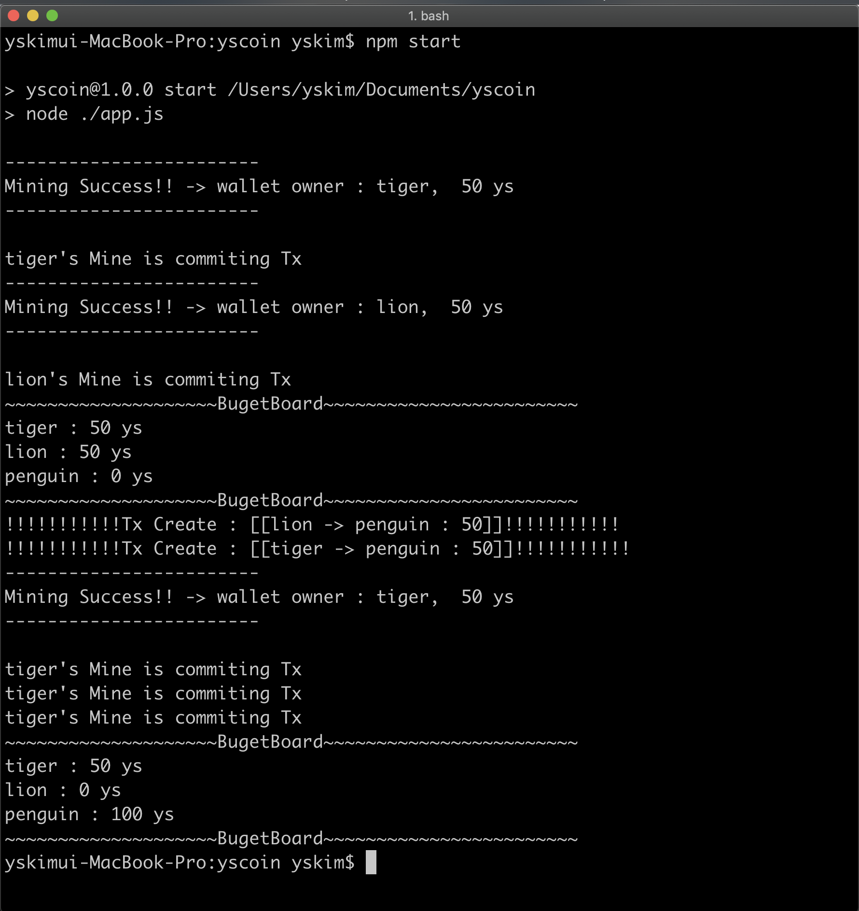

# YS coin

- A Simple block-chain project contains POW (proof of work) mechanism, Transaction exchange algorithm(use secp256k1)



## what's different from other block-chain tutorials

- I know that tons of tutorials for building a simple block-chain just like this project are already existed all around github or blogs. but I couldn't find a single project with tests for a p2pkh script (even though they made a sort of this but not work!), and actual exchange in a chain. 
- but this project is well-tested. that's why I made this project.

- github 에 많은 block chain 튜토리얼이 있지만, 실제로 tx가 처리되는 과정(p2pkh) 을 테스트 하는 것까지 구현되어있는 경우가 드물다. 실제 교환이 되는 튜토리얼을 만들고 싶어서 제작하였다.

## Install

if you don't have npm (node package manager), should install npm first.


- install a global dependency
- - mocha (a test library for node.js)

```bash
npm -g install mocha 
```

- install local dependencies

``` bash
npm install
```
or
``` bash
npm i
```


## Test

``` bash
npm test
```


## Run

``` bash
npm start
```

## Dependencies

``` json
{
    "buffer": "^5.2.1",
    "buffer-from": "^1.1.1",
    "crypto": "^1.0.1",
    "ripemd160": "^2.0.2",
    "secp256k1": "^3.5.2",
    "sha256": "^0.2.0"
}
```